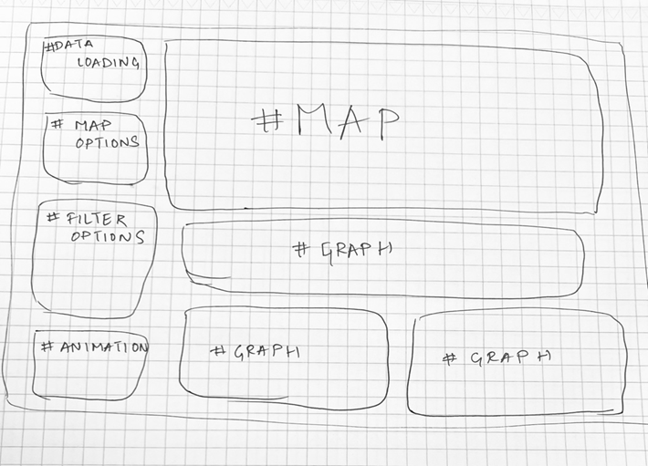

**Global Earthquake Visualization (2014-2025)**

**Project Motivation**

Earthquakes occur around the world every day, with varying intensities and impacts. While many are familiar with major fault lines like the "Ring of Fire," earthquakes can happen in unexpected places too, including the Midwest United States. This visualization application aims to help users explore and understand earthquake patterns globally over the past decade.

By visualizing earthquake data from the US Geological Survey (USGS), this application allows users to:

- Observe the geographic distribution of earthquakes worldwide
- Analyze patterns of seismic activity over time
- Understand the relationships between earthquake magnitude, depth, and frequency
- Identify regions with unusual seismic activity

This tool can serve educational purposes, aid in disaster preparedness discussions, and highlight the importance of earthquake monitoring and planning globally.

**Data Description**

This application uses earthquake data from the US Geological Survey (USGS), which maintains comprehensive records of seismic events worldwide.

**Data Source**

The data was obtained from the USGS Earthquake Search portal: <https://earthquake.usgs.gov/earthquakes/search/>

**Dataset Characteristics**

- **Time Period**: January 2014 - March 2025
- **Number of Records**: Approximately 178,000 earthquakes (magnitude 3.0+)
- **Geographic Coverage**: Global
- **Key Attributes**:
  - **Time**: Date and time of the earthquake (in UTC)
  - **Location**: Latitude and longitude coordinates
  - **Depth**: Distance below the Earth's surface (in kilometers)
  - **Magnitude**: Measure of earthquake strength (logarithmic scale)
  - **Place**: Description of the earthquake location

**Data Preprocessing**

The raw USGS data was preprocessed to:

- Filter out earthquakes below magnitude 3.0
- Remove duplicate records
- Extract year information for easier filtering
- Handle missing values and standardize formats
- Optimize data structure for web-based visualization

**Visualization Components**

The application consists of several interconnected visualization components that allow users to explore different aspects of the earthquake data.

**Interactive Map**

The central component is an interactive, pan-and-zoom map powered by Leaflet and D3.js.

- **Earthquake Markers**: Each earthquake is represented as a circle positioned by latitude and longitude
- **Size Encoding**: Circles are sized according to earthquake magnitude (optional setting)
- **Color Encoding**: Users can color earthquakes by magnitude, depth, or year
- **Details on Demand**: Hovering over an earthquake reveals detailed information including location, time, magnitude, and depth
- **Map Backgrounds**: Users can toggle between different map backgrounds (OpenStreetMap, satellite imagery, dark theme, and light theme)

**Timeline View**

A timeline chart shows the distribution of earthquakes over time.

- **Temporal Distribution**: Bar chart showing earthquake frequency by month/year
- **Brushing Feature**: Users can select a specific time range to filter the data
- **Interactive Tooltip**: Hovering reveals the count of earthquakes in each time period
- **Visual Integration**: The timeline updates dynamically based on other applied filters

**Magnitude Distribution Chart**

This chart visualizes the frequency of earthquakes across different magnitude ranges.

- **Magnitude Bins**: Grouped into ranges (3.0-3.9, 4.0-4.9, 5.0-5.9, 6.0-6.9, 7.0-7.9, 8.0+)
- **Color Consistency**: Colors match the magnitude scale used on the map
- **Selection Feature**: Clicking a bar filters the map to show only earthquakes in that magnitude range
- **Details on Demand**: Hovering shows the exact count in each magnitude category

**Depth Distribution Chart**

This visualization shows the frequency of earthquakes at different depths beneath the Earth's surface.

- **Depth Categories**:
  - Shallow: 0-30 km and 31-70 km
  - Intermediate: 71-300 km
  - Deep: 301-700 km
- **Color Encoding**: Color gradient represents depth ranges
- **Selection Feature**: Clicking a bar filters the map to show only earthquakes in that depth range
- **Educational Context**: Includes labels explaining depth classification (shallow, intermediate, deep)

**Animation Controls**

The application includes animation functionality to visualize earthquake occurrences over time.

- **Timeline Animation**: Play button animates earthquakes chronologically
- **Speed Control**: Adjustable animation speed
- **Visual Fadeout**: Recent earthquakes appear more prominently while older ones fade
- **Time Indicator**: Current animation time displayed for context

**User Interactions and Filtering**

The application offers multiple ways for users to interact with and filter the data:

**Direct Controls**

- **Magnitude Slider**: Filter earthquakes by minimum magnitude
- **Depth Slider**: Filter earthquakes by minimum depth
- **Year Range Selector**: Select start and end years for the data display
- **Reset Button**: Clear all filters and return to default view

**Brushing and Linking**

The visualizations are linked, enabling a coordinated multi-view analysis:

1. **Timeline Selection**: Selecting a time period on the timeline filters the map and charts
2. **Magnitude Chart Selection**: Clicking a magnitude bar filters the map and timeline
3. **Depth Chart Selection**: Clicking a depth bar filters the map and timeline
4. **Hover Highlighting**: Hovering over chart elements highlights corresponding earthquakes on the map

**Color Scheme Selection**

Users can change how earthquakes are colored on the map:

- **Magnitude**: Blue-to-red color scale (diverging) showing intensity
- **Depth**: Viridis color scale (sequential) representing depth beneath surface
- **Year**: Rainbow color scale (categorical) differentiating earthquakes by year

**Design Process and Decisions**

**Design Sketches**

**Color Scheme Justification**

- **Magnitude Coloring**: Used a diverging blue-to-red color scheme because:
  - Red intuitively represents danger/intensity for higher magnitudes
  - Blue represents calmer/less intense for lower magnitudes
  - The diverging nature helps distinguish different ranges clearly
- **Depth Coloring**: Used the Viridis color scale because:
  - It's perceptually uniform and colorblind-friendly
  - Works well for sequential data (shallow to deep)
  - Provides good contrast against most map backgrounds
- **Year Coloring**: Used a rainbow spectrum because:
  - Helps distinguish multiple years in a categorical manner
  - Provides high contrast between adjacent years
  - Familiar color progression for temporal data

**Map Design Considerations**

- **Default View**: Centered at 20°N, 0°E with zoom level 2 to show global earthquake distribution
- **Background Options**: Included light, dark, terrain, and satellite options to accommodate different analysis needs and preferences
- **Marker Sizing**: Exponential scaling (2^magnitude/2) to account for the logarithmic nature of earthquake magnitude

**Findings and Insights**

Through this visualization, several patterns and insights emerge:

1. **Ring of Fire Concentration**: The Pacific "Ring of Fire" shows the highest concentration of seismic activity, accounting for approximately 75% of all mapped earthquakes.
2. **Depth Patterns**: Deep earthquakes (300+ km) occur primarily in specific subduction zones, particularly in the western Pacific and South America.
3. **Temporal Patterns**: Notable earthquake "swarms" (clusters of earthquakes in time and space) are visible in:
    - Indonesia region (2018)
    - New Zealand (2016)
    - Japan (2021)
4. **Magnitude Distribution**: As expected, the frequency of earthquakes decreases exponentially as magnitude increases, with approximately:
    - 10x more magnitude 3.0 earthquakes than magnitude 4.0
    - 100x more magnitude 3.0 earthquakes than magnitude 5.0
5. **Unusual Activity**: Several regions show unexpected earthquake clusters outside major fault lines, including:
    - Central United States (Oklahoma)
    - Spain
    - Australia's southeastern coast

**Implementation Details**

**Technologies Used**

- **D3.js**: Core visualization library for creating interactive charts
- **Leaflet**: Interactive mapping library
- **JavaScript**: Primary programming language
- **HTML/CSS**: Structure and styling
- **PapaParse**: CSV parsing library
- **Python**: Used for data preprocessing

**Code Structure**

The application follows a modular structure:

- **Data Loading**: Functions to parse and prepare the earthquake data
- **Map Visualization**: Code to render and update the Leaflet map
- **Chart Components**: Separate modules for timeline, magnitude, and depth charts
- **Interaction Handlers**: Functions that handle user inputs and filter updates
- **Animation System**: Code for the timeline animation functionality

**Development Process**

1. **Data Exploration**: Analyzed the USGS data to understand structure and characteristics
2. **Sketching & Planning**: Created wireframes and planned visualization components
3. **Core Implementation**: Built the map visualization and basic filtering
4. **Advanced Features**: Added charts, animation, and brushing functionality
5. **Optimization**: Improved performance for handling large datasets
6. **Testing & Refinement**: Tested on different browsers and refined the user experience

**Demo**

<video width="320" height="240" controls>
<source src="quake-data-vis-demo-video.mp4" type="video/mp4">
</video>

**Accessing the Application**

- **Live Application**: \[Include your deployed application URL here\]
- **Source Code**: \[Include link to your source code repository\]
- **Local Setup**:
    1. Clone the repository
    2. Navigate to the project directory
    3. Open index.html in a web browser or use a local server

**Team Contributions**

- **Siddhant Shah**
  - Data preprocessing and cleaning
  - Map visualization implementation
  - Documentation
  - Magnitude and depth charts
  - Brushing and linking implementation
- **Nam Nguyen**
  - Time series visualization
  - Animation functionality
  - User interface design
  - Magnitude and depth charts
  - Testing and debugging

**Future Enhancements**

With additional time and resources, the visualization could be enhanced with:

1. **Real-time Data**: Integration with USGS API for live earthquake updates
2. **Predictive Visualization**: Add historical average patterns to identify unusual activity
3. **Mobile Optimization**: Responsive design for better mobile device experience
4. **Social Impact**: Add population density overlay to visualize potential human impact
5. **3D Visualization**: Add option for 3D globe view with depth representation

**References**

1. U.S. Geological Survey. (2025). Earthquake Search. <https://earthquake.usgs.gov/earthquakes/search/>
2. U.S. Geological Survey. (2025). Earthquake Magnitude, Energy Release, and Shaking Intensity. <https://www.usgs.gov/programs/earthquake-hazards/earthquake-magnitude-energy-release-and-shaking-intensity>
3. U.S. Geological Survey. (2025). Determining the Depth of an Earthquake. <https://www.usgs.gov/programs/earthquake-hazards/determining-depth-earthquake>
4. Bostock, M., Ogievetsky, V., & Heer, J. (2011). D3: Data-Driven Documents. IEEE Transactions on Visualization and Computer Graphics, 17(12), 2301-2309.
5. Agafonkin, V. (2010). Leaflet: an open-source JavaScript library for mobile-friendly interactive maps. <https://leafletjs.com/>
